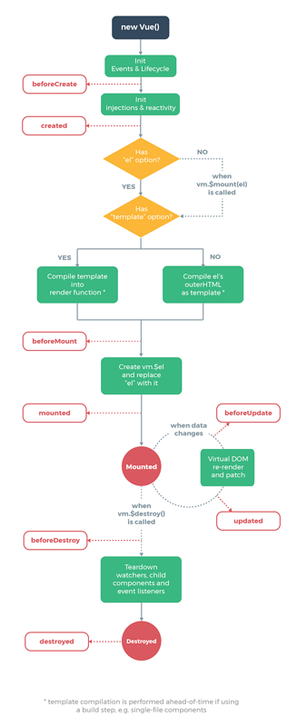

## Vue起步##

最近在复习vue.js，所以准备从头开始梳理一遍vue.js，也好在假期的时候用它来做项目。

先复习几个基本的语法吧。（在此使用的代码是用`<scirpt>`标签引入的，顺序按照是[官方文档](https://cn.vuejs.org/v2/guide/index.html)来的）：


1. 声明式渲染：

   首先我们得知道什么是渲染，前端的渲染在我理解来就是：通过在`html`页面写入少量代码，然后通过`js`或者其他手段，往这个`html`页面里面填东西进去，最后用户看到的界面将是非常丰富的。然后vue.js的核心是采用简洁的声明式渲染，将数据渲染进DOM：

   ```html
   <!DOCTYPE html>
   <html lang="en">
   <head>
       <meta charset="UTF-8">
       <title>Vue-LifeCycle</title>
       <script src="https://cdn.jsdelivr.net/npm/vue@2.5.16/dist/vue.js"></script>
   </head>
   <body>
   <div id="app">
       <p>{{msg}}</p>
   </div>
   <script>
       var app = new Vue({
           el: '#app',
           data: {
               msg: 'hello world'
           }
       })
   </script>
   </body>
   </html>
   ```

   此时你将在页面上看到 hello world 字样。

   ​

2. `v-if`于`v-for`：

   首先是`v-if`语句：我们只需要在刚才的`div`中加入即可：

   ```Html
   <div id="app" v-if="display">
       <p>{{msg}}</p>
   </div>
   ```

   js中改为：

   ```js
   var app = new Vue({
           el: '#app',
           data: {
               msg: 'hello world',
               display: true
           }
       })
   ```

   这里面根据`v-if`后面接的语句的布尔值来判断是否显示元素，你可以在控制台中输入：

   `app.display = false`来让这个div元素隐藏。

   然后是`v-for`我们可以利用该语句来循环显示某些东西，比如一个列表，代码如下：

   ```html
   <div id="app" v-if="display">
       <p>{{msg}}</p>
       <ol>
           <li v-for="app in apps">
               {{app.value}}
           </li>
       </ol>
   </div>
   ```

   js代码：

   ```js
   var app = new Vue({
           el: '#app',
           data: {
               msg: 'hello world',
               display: true,
               apps: [
                   {value: "苹果"},
                   {value: "梨子"},
                   {value: "香蕉"}
               ]
           }
       })
   ```

   那么我们在页面中就可以看到一个有序列表，分别为苹果，梨子，香蕉。

   在此我们要注意：`v-for`后面的语句是`A in B`的形式B是存整个数据即多个对象的一个数组，那么A是你要在接下来的`<li>`标签中写进的，可以理解为多个A对象形成数组B，那么在循环渲染的时候，只需要在双括号中写入A的属性即可进行渲染。

   ​

3. `v-on`：

   `v-on`即为js中的的事件监听，监听某个事件，当触发事件时调用指定函数，在此我们通过监听点击事件触发逆转页面中的文字：

   ```Html
   <div id="app">
       <p>{{msg}}</p>
       <button v-on:click="reverse">reverse</button>
   </div>
   ```

   Js:

   ```Js
   var app = new Vue({
           el: '#app',
           data: {
               msg: 'hello world',
           },
           methods: {
               reverse: function () {
                   this.msg = this.msg.split('').reverse().join('')
                   // split方法是将一个字符串按照一定的规定拆为一个数组
                   // reverse方法是将数组的顺序变为逆序
                   // join方法与split方法相反，将数组中的元素组合成为一个字符串
               }
           }
       })
   ```

   那么，我们在点击按钮之后就会将页面中的字符中逆转。

---

#### Vue实例####

每一个Vue的应用都是`Vue`函数创建一个新的Vue实例开始的

```Js
var something = new Vue({
    .......
})
```

在一个Vue实例被创建后，在实例中的data总是响应式的，当data的属性值发生变化的时候，视图也会发生相应的变化，这是Vue的响应式系统。

```js
var data = { a: 1} //数据对象

var vm = new Vue({
    data: data
})
//将刚刚创建的数据对象传入刚刚实例的vm对象中

vm.a = data.a // => true
vm.a = 2;
data.a // => 2
//反之亦然
//说明他们是双向绑定的，改变其中一个都是影响到另外的一个属性
```

需要响应式的数据绑定的话，不需要实例再被创建时有这个属性。那么如果我们我们在编程的过程中不知道要用什么属性的时候怎么办？很简单，我将所有的数据类型都赋值为空，并在实例的时候就创建好，要用的时候只需要应用它们即可：

```js
data:{
    one: '',
    two: [],
    three: 0,
    four: false,
    five: null
}
```

那么我们要怎么样去接触跟踪呢？使用`object.freeze()`即可：

```Html
<div id="app">
    <button v-on:click="say">run say</button>
</div>
```

```js
    var obj = {
        data: 'lisongwei'
    };
    Object.freeze(obj);
    var am = new Vue({
        el: '#app',
        data: obj,
        methods: {
            say: function () {
                console.log(this.data)
            }
        }
    })
```

当你在浏览器中点击按钮之后，控制台会打印出lisongwei字样，当时你在控制台中输入：

```js
obj.data = 'hhh'
```

之后，再次点击按钮，发现am对象中的data值还是原来那个，这就很好地说明了，`Object.freeze()`方法能够阻断跟踪。


`$`用法：

在官方文档上面我有一点没有看懂的$的用法，但是接下来的两个例子可以很好地解释它的用法：

```html
<div id="app">
    <button v-on:click="say">run say</button>
</div>
```

```js
var obj = {
        data: 'lisongwei'
    };
    var am = new Vue({
        el: '#app',
        data: obj,
        methods: {
            say: function () {
                console.log(this.$data);
                console.log(this.$el)
            }
        }
    })
```

你将在控制台看到的是：

```
{data: "lisongwei"}
data:"lisongwei"
__proto__:Object


<div id="app">
    <button>run say</button>
</div>
```

那么就说明通过  `$`  ，把它后面的整体全部打印出来了，这个整体可能是HTML元素，也可能是一个整体对象。在我的理解中`$`就是把实例后的全部属性。


### 生命周期###

首先给出生命周期的官方示意图：代表了一个对象的生命周期：




那么我们可以看到：从初始化到销毁的全过程，我现在还不能全部理解，暂时参考<https://segmentfault.com/a/1190000011381906>等我多以Vue的经验的时候再来讲解。