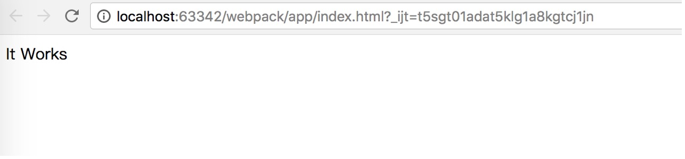
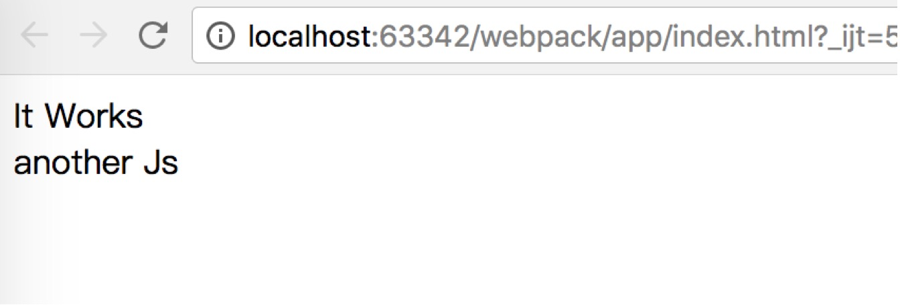

# webpack学习#

​	首先我是根据[菜鸟教程的webpack教程](https://www.runoob.com/w3cnote/webpack-tutorial.html)走的，但是一路中遇到了很多问题，去网上也找了很多，发现大多数都是一样的，治标不治本，也看到了一篇讲的比较好的[博客](https://blog.csdn.net/u012443286/article/details/79504289)接下来我会说的；

首先是全局安装webpack：

```
sudo npm install webpack -g
```

接下来创建一个目录app

```
mkdir app
```

在app目录下创建one.js的文件，代码为；

```
document.write("It works");
```

然后在app目录下添加index.html文件，代码如下：

```html
<!DOCTYPE html>
<html lang="en">
<head>
    <meta charset="UTF-8">
    <title>webpack</title>
</head>
<body>
<script src="bundle.js" charset="utf-8"></script>
</body>
</html>
```

接下来开始打包：

```
webpack one.js bundle.js
```

你会发现命令行给出如下信息：

```
The CLI moved into a separate package: webpack-cli
Would you like to install webpack-cli? (That will run npm install -D webpack-cli) (yes/NO)
It needs to be installed alongside webpack to use the CLI
```

这意思是说如果我们不额外安装webpack-cli的话，那么就不能使用webpack相关命令，好吧，那么我们就安装webpack-cli：

```
sudo npm install webpack-cli -g
```

再次打包：

```
webpack one.js bundle.js
```

终端中会出现：

```
Hash: e8a25114f76c8c945460
Version: webpack 4.6.0
Time: 243ms
Built at: 2018-04-21 23:54:38
 1 asset
Entrypoint main = main.js
[0] ./one.js 27 bytes {0} [built]
[1] multi ./one.js bundle.js 40 bytes {0} [built]

WARNING in configuration
The 'mode' option has not been set, webpack will fallback to 'production' for this value. Set 'mode' option to 'development' or 'production' to enable defaults for each environment.
You can also set it to 'none' to disable any default behavior. Learn more: https://webpack.js.org/concepts/mode/

ERROR in multi ./one.js bundle.js
Module not found: Error: Can't resolve 'bundle.js' in '/Users/lsw/Desktop/workspace/LearningProcess/webpack/app'
 @ multi ./one.js bundle.js
```

这又是怎么回事？从ERROR可知，这个错误是由于未引入入口模块而引发，那么接下来我们将创建入口文件：

1. 首先在app目录下创建一个src目录用来存储需要打包的js文件，将one.js改为index.js之后移动到 `'./src'` 

2. 此时不能再使用之前`webpack a文件 b文件的方式` 运行了，这是webpack3.x的语法，我们应该用：

   ```
   webpack --mode development
   ```

   或者

   ```
   webpack --mode production
   ```

   进行打包，这样就能将`'./src'`中的js文件打包到`./dist/main.js`中。

   那么此时我们的webpack就算配置完成，运行最后的两句命令之中一个，在打开`index.html`发现终端正常，显示：

   ```
   lisongweideMacBook-Pro:app lsw$ webpack --mode development
   Hash: 48226ba956a35ff37c23
   Version: webpack 4.6.0
   Time: 70ms
   Built at: 2018-04-22 00:39:57
     Asset      Size  Chunks             Chunk Names
   main.js  2.83 KiB    main  [emitted]  main
   Entrypoint main = main.js
   [./src/index.js] 27 bytes {main} [built]
   ```

   界面也能成功显示：

   


当然如果我们每次都要输入

```
webpack --mode development
```

or

```
webpack --mode production
```

的话，比较麻烦，为了提高效率，我们在app目录先创建一个`package.json`文件，并在其中加入：

```
"scripts": {
    "dev": "webpack --mode development",
    "build": "webpack -- mode production"
  },
```

加入后我们以后就直接可以用：

```
npm run dev
```

or

```
npm run build
```

进行打包了。


另外，我简单说一下，如果要讲多个Js文件一起打包的话，例如

​	我们再创建一个新的js文件`another.js`如果要是其也被一并打包的那么就需要被入口的js文件`index.js`引用，具体做法如下：

首先需要使用到`exports`属性，`another.js`的具体代码如下：

```
exports.another = function () {
    document.write("another Js")
}
```

因为要使用了`exports`对象，该文件才能被其它Js文件引用，然后`index.js`代码如下：

```
var ano = require('./another');
document.write("It Works" + "<br>");
ano.another();
```

让我们再来打包：

```
npm run dev
```

此时的界面就被改变了：



这个时候`./dist/main.js`就是之前两个js文件`index.js` `another.js`合并打包而成的。

-----

